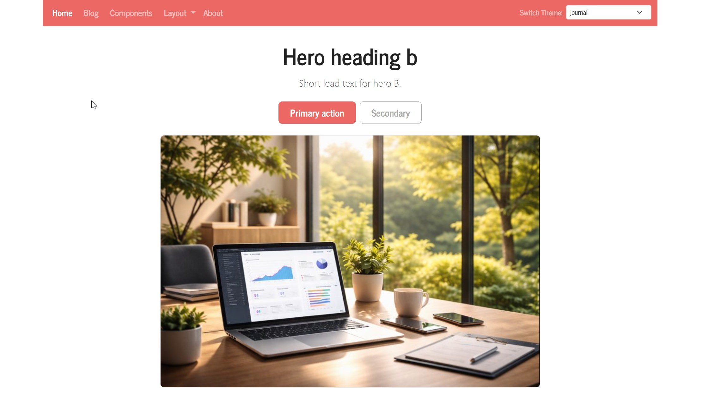

← [Docs Overview](../../README.md) ·
[Featured Posts](featured-posts.md) ·
[Hero Split](hero-split.md) ·
[Hero Centered](hero-centered.md) ·
[Features Icons](features-icons.md) ·
[Features Hanging Icons](features-hanging-icons.md) ·
[Features Cards](features-cards.md)


## Block: `hero-centered`

Centered hero block with optional buttons and an optional image displayed below the text.




### Usage

* Home page: `type: hero-centered`, `content: blocks/<name>`
* Markdown: ``


### Block Content (`content/blocks/<name>/index.md`)

Configured via front matter only.

**Fields:**

* **title**
  Main heading of the hero block (page title). Rendered as centered `<h1>`. *(optional)*

* **lead**
  Short descriptive text displayed below the title. Rendered as a centered Bootstrap `lead` paragraph (muted). *(optional)*

* **buttons**
  Optional list of call-to-action buttons (centered).

  Each button defines:

  * `text` – button label
  * `ref` or `url` – internal reference or external link
  * `style` – Bootstrap button style (default: `primary`)

* **image**
  Optional image shown **below** the text/buttons (centered).

  Fields:

  * `src` – image filename, relative path, or URL
  * `alt` – alternative text used for accessibility and SEO *(optional)*

  If `src` matches a page resource of the block content page, that resource is used.
  Otherwise, the value is treated as a regular path or URL.

### Example

```
---
title: "Felmdrav in a nutshell"
lead: "Centered hero layout with optional buttons and a framed image."
buttons:
  - text: "Documentation"
    ref: "posts"
    style: "primary"
  - text: "About"
    ref: "about"
    style: "outline-secondary"
image:
  src: "hero.png"
  alt: "Preview image"
---
```

### Notes

* Layout is centered (`text-center`) with a constrained text width (`col-lg-8 col-md-10 mx-auto`).
* The image is rendered only if `image.src` is set; it is displayed below the content with rounded corners and a border.
* If the block content page cannot be resolved, nothing is rendered.


--- 

← Previous: [Hero Split](hero-split.md)
Next: [Features Icons](features-icons.md) →
